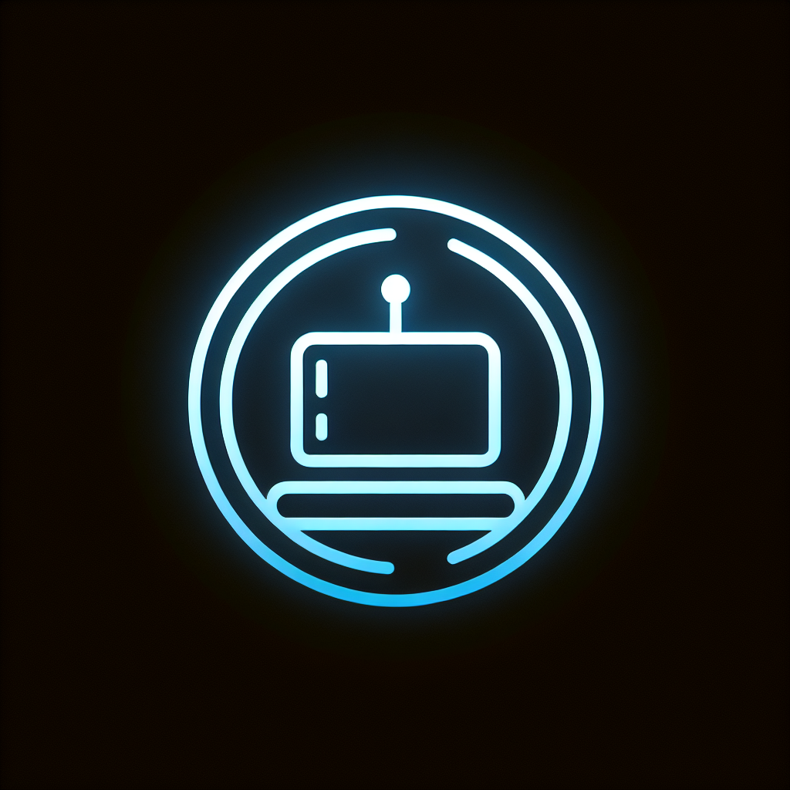

# KubeCLI Web Console

A web-based terminal for executing Kubernetes commands through a browser interface.



## Features

- **Kubernetes Command Execution**: Execute kubectl commands directly from your browser
- **Context & Namespace Selection**: Easily switch between different Kubernetes contexts and namespaces
- **Pod Selection**: Run commands inside specific pods with a simple dropdown selection
- **Command History**: View and manage your previously executed commands
- **Settings Management**: Customize your experience with dark mode and terminal preferences
- **Docker Deployment**: Deploy the application with Docker for easy access from anywhere

## Getting Started

### Prerequisites

- Node.js (v20 or later)
- For local development: kubectl installed and configured
- For Docker deployment: Docker and Docker Compose

### Installation

#### Local Development

1. Clone the repository:
   ```
   git clone https://github.com/yourusername/kubectl-web-console.git
   cd kubectl-web-console
   ```

2. Install dependencies:
   ```
   npm install
   ```

3. Start the development server:
   ```
   npm run dev
   ```

4. Open your browser and navigate to `http://localhost:5000`

#### Docker Deployment

1. Clone the repository:
   ```
   git clone https://github.com/yourusername/kubectl-web-console.git
   cd kubectl-web-console
   ```

2. Make the run script executable:
   ```
   chmod +x run-docker.sh
   ```

3. Run the Docker container:
   ```
   ./run-docker.sh
   ```

4. Open your browser and navigate to `http://localhost:5000`

## Configuration

### Kubernetes Contexts and Namespaces

The application loads Kubernetes contexts and namespaces from the `k8s-config.json` file. You can modify this file to add your own contexts and namespaces:

```json
{
  "contexts": [
    "minikube",
    "docker-desktop",
    "production",
    "staging",
    "dev"
  ],
  "namespaces": {
    "minikube": ["default", "kube-system", "kube-public", "monitoring", "custom"],
    "docker-desktop": ["default", "kube-system", "kube-public", "docker", "ingress-nginx"],
    "production": ["default", "kube-system", "kube-public", "app", "monitoring", "services", "ingress"],
    "staging": ["default", "kube-system", "kube-public", "test", "development"],
    "dev": ["default", "kube-system", "kube-public", "my-app", "testing"]
  },
  "defaultContext": "minikube",
  "defaultNamespace": "default"
}
```

### Docker Configuration

For Docker deployment, the application is configured to use your local Kubernetes configuration file. The `docker-compose.yml` file mounts your kubeconfig file and the application's configuration file:

```yaml
volumes:
  # Mount the Kubernetes config file for accessing clusters
  - ${HOME}/.kube:/root/.kube:ro
  # Mount the config file for contexts and namespaces
  - ./k8s-config.json:/app/k8s-config.json:ro
```

## Usage

### Terminal Interface

1. **Select Context**: Choose which Kubernetes context to use from the dropdown
2. **Select Namespace**: Choose the namespace to work in
3. **Select Pod (Optional)**: If you want to run commands inside a specific pod, select it
4. **Enter Command**: Type your kubectl command in the terminal input
5. **Execute**: Press Enter or click the Execute button to run the command
6. **View Results**: See the command output in the terminal window below

### Command History

Navigate to the History tab to view your command history. You can:
- See all previously executed commands
- View command outputs
- Clear your command history

### Settings

In the Settings tab, you can customize your experience:
- Toggle dark/light mode
- Change terminal font size
- Enable/disable auto-clear terminal

## Security

The application includes several security features:

- **Command Validation**: Prevents potentially dangerous commands
- **Input Sanitization**: Blocks command injection attempts
- **Restricted Access**: Using Docker to isolate the kubectl environment

## License

This project is licensed under the MIT License - see the LICENSE file for details.

## Acknowledgments

- Built with React, Express, and TypeScript
- User interface components from Shadcn UI
- State management with Zustand